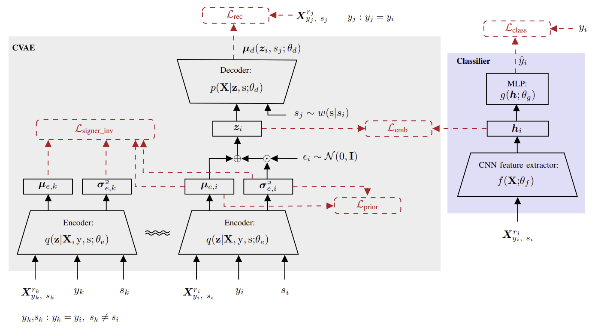

# DeSIRe
Deep Signer-Invariant Representations for Sign Language Recognition

## Description
Source code for the implementation of **DeSIRe**, a novel deep neural network that aims to learn **De**ep **S**igner-**I**nvariant **Re**presentations, as described in the paper:

P. M. Ferreira, D. Pernes, A. Rebelo and J. S. Cardoso, "**[DeSIRe: Deep Signer-Invariant Representations for Sign Language Recognition](https://ieeexplore.ieee.org/abstract/document/8937777)**", *in IEEE Transactions on Systems, Man, and Cybernetics: Systems*. doi: 10.1109/TSMC.2019.2957347

|   |
|:---:|

## Example of Usage

***Train:*** 
~~~bash
python run.py --adv_weight=0.6 --transf_weight=0.0002 --model=transf_cnn --dataset=staticSL --gpu=0 --mode=train
~~~

***Test:*** 
~~~bash
python run.py --model=transf_cnn --dataset=staticSL --gpu=0 --mode=test
~~~

## Datasets
**Jochen-Triesch database**: Jochen Triesch and Christoph von der Malsburg. A system for person-independent hand posture recognition against complex backgrounds. IEEE Trans. Pattern Anal. Mach. Intell., 23(12):1449–1453, December 2001.

**Microsoft Kinect and Leap Motion American sign language dataset**: Giulio Marin, Fabio Dominio, and Pietro Zanuttigh. Hand gesture recognition with jointly calibrated leap motion and depth sensor. Multimedia Tools and Applications, 75(22):14991–15015, Nov 2016.
